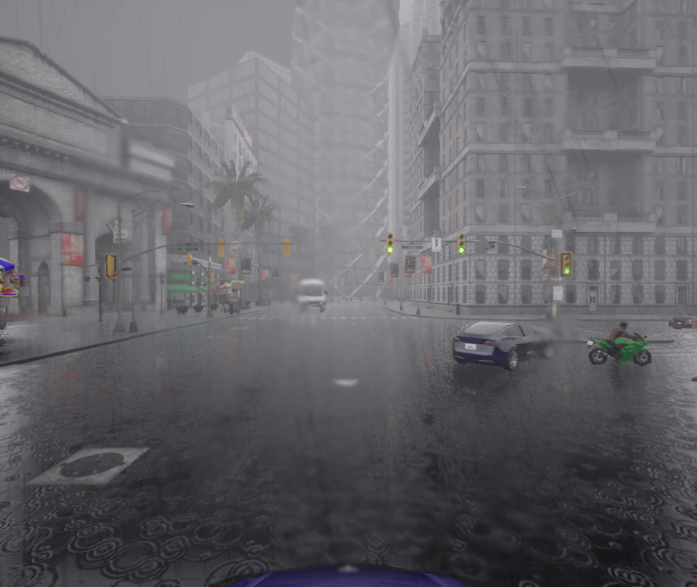

  
  
  ## Vision–Language–Action Dataset for Cooperative Autonomous Driving
  

 
)

<b>VLA4CoDrive</b> is a large-scale <b>cooperative Vision–Language–Action (VLA)</b> dataset designed to support autonomous driving under multi-vehicle cooperation. This work has been accepted to the <b>IEEE/CVF Winter Conference on Applications of Computer Vision (WACV) 2026</b>.

---

## 🔍 Overview

We introduce VLA4CoDrive, a cooperative Vision–Language–Action dataset with synchronized multi-vehicle sensing across diverse driving environments, providing multi-view visual streams, contextual text (caption, context, description, reasoning), and future trajectory actions for training and evaluating VLA driving models.

  

---

## 📌 Dataset

<b>VLA4CoDrive</b> is organized into three tightly aligned modalities, <b>Vision</b>, <b>Language</b>, and <b>Action</b>, each captured under the following settings:

<table border="0" cellspacing="0" cellpadding="0">
<tr>
<td width="50%" valign="top">

- 🤝 **Cooperative Multi-Vehicle Setup**  
  Synchronized sensing from multiple vehicles within the same driving episode

- 👁️ **Multi-View & Multi-Modal Perception**  
  RGB (front/rear/left/right), LiDAR, semantic LiDAR, optical flow, GNSS, IMU

- 📝 **Structured Vision–Language Grounding**  
  Clip-level annotations including **Context, Caption, Description, and Reasoning**

- 🎯 **Action & Trajectory Supervision**  
  Low-level controls (steer/throttle/brake) + 30-step future trajectories

</td>
<td width="50%" valign="top">

- 🌦️ **Controlled Diversity**  
  8 CARLA towns × 8 weather conditions with frame-aligned replay

- 📏 **Large-Scale Dataset**  
  - ~10M vision samples  
  - ~150K language annotations  
  - ~1M action records  
  - ~300–360 hours of driving data  

- 📦 **Standard Annotation Formats**  
  COCO, PASCAL VOC, KITTI (2D & 3D)

</td>
</tr>
</table>

### 👁️ VLA4CoDrive — Vision

Multi-view and multi-modal perception from synchronized cooperating vehicles, capturing complementary visual evidence for cooperative understanding.

  

  

  

### 📝 VLA4CoDrive — Language

Structured, clip-level language grounding generated from synchronized multi-agent scenes, capturing both scene semantics and short-horizon driving intent.

  

### 🎯 VLA4CoDrive — Action

Time-aligned action supervision providing low-level controls and future trajectory targets, enabling imitation, forecasting, and language-conditioned planning.

| **Key** | **Value** |
|---|---|
| frame |  |
| frame_id | `002622` |
| timestamp | `12481` |
| gearShifter | `drive` |
| brake | `0.0` |
| brakePressed | `false` |
| vEgo | `8.3380` |
| vEgoRaw | `8.3380` |
| aEgo | `2.2104` |
| accelerations_device | `[2.2104, -3.0556, 9.8081]` |
| accelerations_calib | `[2.2104, -3.0556, 9.8081]` |
| angular_velocities_device | `[0.00230, 0.00070, -0.36498]` |
| angular_velocities_calib | `[0.00230, 0.00070, -0.36498]` |
| velocities_calib | `[8.3296, -0.3735, 0.0000]` |
| positions_ecef | `[6378139.50, -48.14, 15.43]` |
| extrinsic_matrix | `4×4 matrix (see JSON)` |
| intrinsic_matrix | `3×3 matrix (see JSON)` |
| trajectory_count | `30` |
| trajectory | [[0.0, 0.0, 0.0], [0.8275010935306759, -0.04821085876190756, 5.1460228860378265e-05], [1.6381458417505876, -0.12501369526440165, 0.00012107845395803452], [2.4244511094026953, -0.2344291940837998, 0.000176658621057868], [3.185244780733905, -0.39312163062116134, 0.00019313814118504524], [3.9298614372630545, -0.612868890162207, 0.00014945981092751026], [4.683324309610262, -0.8823274481627621, 5.035405047237873e-05], [5.454253093046091, -1.1856216876290973, -6.904592737555504e-06], [6.214982731927573, -1.5261434656207276, 4.1389488615095615e-05], [6.948101762385089, -1.8921376276380677, 0.00011508946772664785], [7.644002232229405, -2.2812337434234577, 0.00018184666987508535], [8.311576173004438, -2.6883381010997303, 0.000185737619176507], [8.972671090382748, -3.1091972391105656, 0.00012935639824718237], [9.642792504180107, -3.5487499615343214, 5.081179551780224e-05], [10.324735033181911, -4.005787375082028, 9.19343437999487e-06], [11.00660039244547, -4.473844014640873, 3.288267180323601e-05], [11.676966626025777, -4.941858673255256, 9.204866364598274e-05], [12.332093731260388, -5.4033781985680545, 0.00014080049004405737], [12.976052651337021, -5.859850036152469, 0.00014957424718886614], [13.619010292218759, -6.3176175492788325, 0.00011367793194949627], [14.270971598023293, -6.783213042584521, 5.947111640125513e-05], [14.933883070788191, -7.2576134174966835, 2.8686481527984142e-05], [15.600821812553187, -7.7356100048777305, 4.264828749001026e-05], [16.262800652134572, -8.2105895403186, 8.396152406930923e-05], [16.9149774520535, -8.680089524643837, 0.00012001034338027239], [17.55967605750605, -9.145391107077412, 0.0001282120356336236], [18.203849299595657, -9.610817642782836, 0.00010505679529160261], [18.854042932942548, -10.080827324935955, 6.954197306185961e-05], [19.51155368016565, -10.556230495428062, 4.9018883146345615e-05], [20.171992264576062, -11.033851917102254, 5.714420694857836e-05]]
| caption | *The ego vehicle is moving straight at a moderate speed following a leading car with acceleration. A nearby traffic light shows green under rainy conditions on a wide road. No pedestrians are present. The driver should remain attentive to the traffic light and be prepared to stop if it changes.* |

